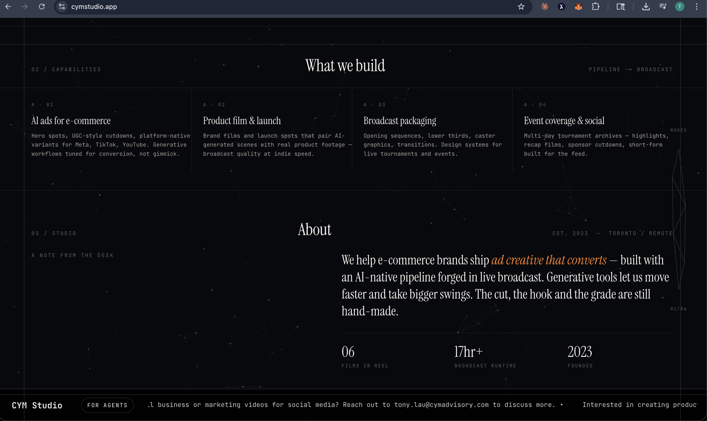
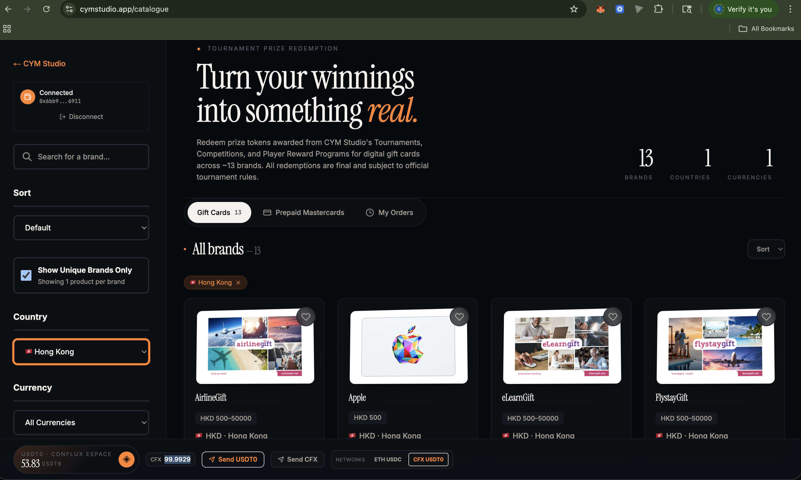
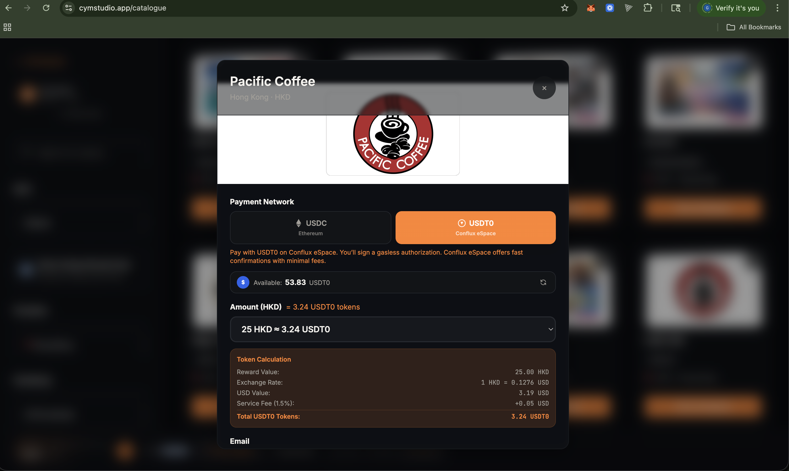
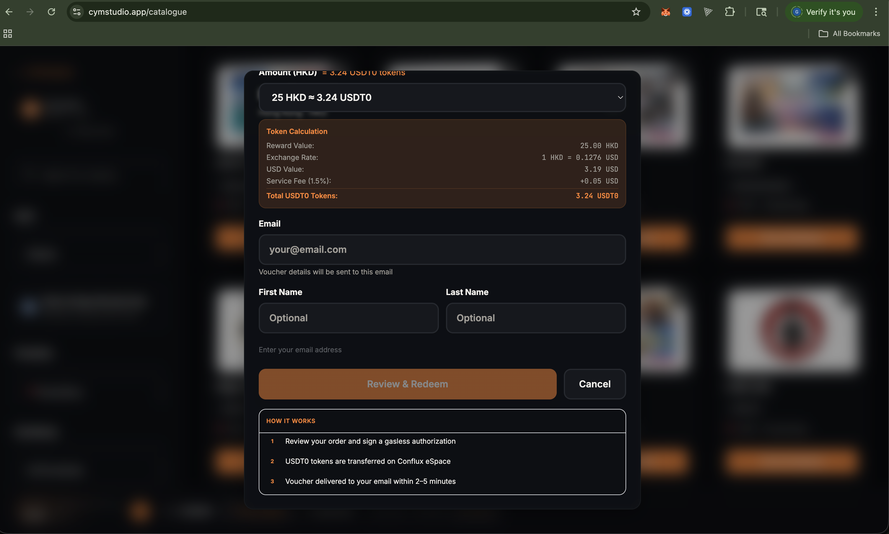
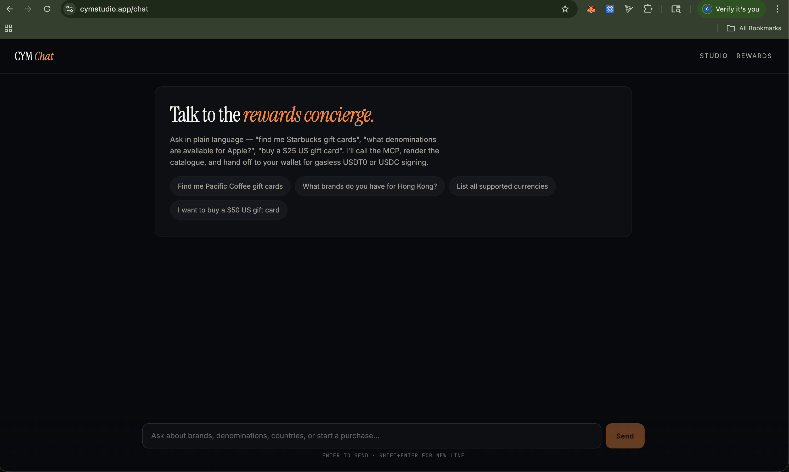
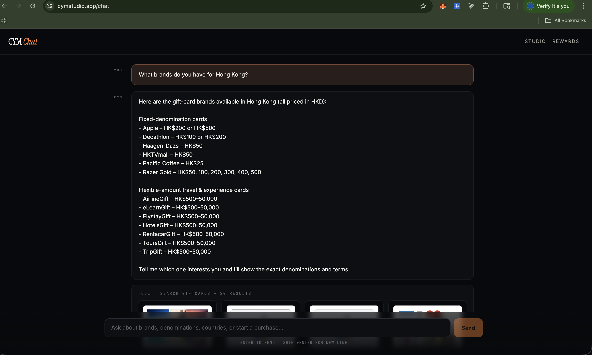

# Demo assets

## Live demo

- **Landing:** https://cymstudio.app
- **Rewards catalogue:** https://cymstudio.app/catalogue
- **AI concierge (chat):** https://cymstudio.app/chat
- **MCP integration guide:** https://cymstudio.app/agents
- **MCP endpoint:** `https://cymstudio.app/api/mcp/rewards`

## Demo video (3–5 min)

**Watch on YouTube:** [youtu.be/0VJXfjlGKjo](https://youtu.be/0VJXfjlGKjo)

Script outline (what's shown):

1. Land on cymstudio.app, tour the editorial showreel (15s)
2. Click Rewards → show the Tournament Prize Redemptions hero, 300+ brand catalogue
3. Connect wallet holding USDT0 (and zero CFX) on Conflux eSpace
4. Pick a Pacific Coffee gift card, verify email via OTP
5. Sign the EIP-3009 `transferWithAuthorization` (single wallet prompt)
6. Show the Conflux eSpace settlement transaction on ConfluxScan
7. Voucher email arrives — demonstrate real fulfillment
8. Switch to `/chat` and ask Kimi "find me a $25 gift card" — show tool-use flow
9. Switch to `/agents` and show the MCP integration guide briefly
10. Close with a 10-second recap of the USDT0-on-Conflux gasless value prop

## Participant intro video (30–60 sec)

`intro.mp4` — TO BE ADDED.

Opening line: "I'm Tony Lau from Toronto, building CYM Rewards for Conflux Network's Global Hackfest 2026 — gasless USDT0 gift card redemptions on Conflux eSpace — and I'm excited to participate."

## Screenshots

All shots live in [`screenshots/`](screenshots/) — captured 2026-04-20 on the live production site.

### Editorial showreel — `/`

The AI video-production portfolio for CYM Studio — the operating entity behind the rewards program.

### Tournament Prize Redemptions — `/catalogue`

300+ brand catalogue, filterable by country and currency. Connected wallets see live USDT0 / USDC balances in the sidebar.

**Gasless checkout.** Pick a network (USDT0 on Conflux eSpace / USDC on Ethereum), confirm the token breakdown (reward value, FX, service fee), enter email for voucher delivery, and sign one EIP-3009 `transferWithAuthorization` — the facilitator pays the CFX/ETH gas.

<table>
  <tr>
    <td width="50%"></td>
    <td width="50%"></td>
  </tr>
</table>

**Proof of settlement.** 25 HKD Pacific Coffee → 3.24 USDT0 on Conflux eSpace → voucher delivered to email. 18 seconds from signature to `Completed` (ordered 1:58:18, completed 1:58:36).

### AI concierge — `/chat`

Natural-language browsing powered by Kimi. Every user turn routes through the same MCP server an external agent would call — so the chat is a live demo of the agent integration.

<table>
  <tr>
    <td width="50%"></td>
    <td width="50%"></td>
  </tr>
</table>

## Winner video

If selected as a winner, a pitch/demo video will be provided for the winners showcase. See [hackfest winner guidelines](https://github.com/conflux-fans/global-hackfest-2026/blob/main/docs/09_winner_video_guidelines.md).
