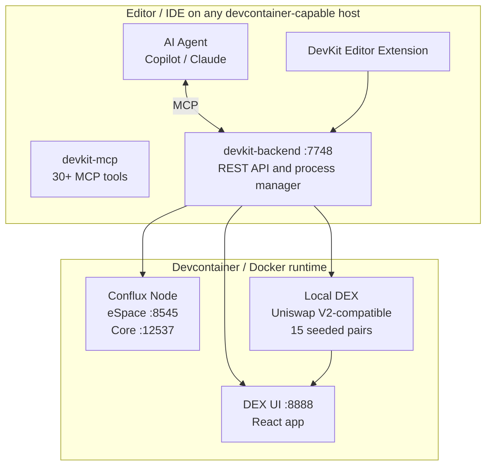

# Conflux DevKit

> Batteries-included Conflux development stack — local node, AI-powered MCP tools, DEX, and scaffold templates, all inside a devcontainer.

[](https://github.com/cfxdevkit/devkit-workspace/blob/main/LICENSE)
[](https://confluxnetwork.org/)
[](https://github.com/conflux-fans/global-hackfest-2026)

---

## Overview

Conflux DevKit eliminates the setup friction that keeps developers away from building on Conflux.
Open the repo in any devcontainer-capable environment — a local IDE, GitHub Codespaces, or any cloud dev host — and in under two minutes you have a fully running local Conflux node (both Core Space and eSpace), a funded genesis wallet, a local Uniswap V2-compatible DEX, contract scaffolding, and an AI-agent control plane (MCP server) that lets any MCP-compatible AI assistant drive the entire workflow — deploy, test, swap, inspect — without leaving your editor.

**What makes it different:** This is a vertical, batteries-included developer stack. Every piece of infrastructure that normally takes hours to configure is pre-wired inside the devcontainer. The AI integration isn't an afterthought; the MCP server exposes 30+ typed tools so LLMs can reliably operate the stack.

**Source repository:** https://github.com/cfxdevkit/devkit-workspace

---

## 🏆 Hackathon Information

- **Event:** Global Hackfest 2026
- **Focus Area:** Developer Experience & Tooling
- **Team:** cfxdevkit
- **Submission Date:** 2026-04-20 @ 11:59:59

---

## 👥 Team

**Team:** cfxdevkit

| Name | Role | GitHub | Discord |
|------|------|--------|---------|
| SP | Solo (multiple roles) | cfxdevkit | spcfxda |

---

## 🚀 Problem Statement

Building on Conflux requires simultaneously managing: a local node, a funded keystore, smart contract toolchains, a frontend, wallet integration, and (increasingly) AI agent workflows.
Each component has its own documentation, its own CLI, and its own failure modes.
A developer who wants to try Conflux typically spends the first day just getting something to
run locally — before writing a single line of product code.

This problem is especially acute for:
- Hackathon participants who have 6 weeks and no time to waste on infrastructure
- Web2 developers evaluating Conflux for the first time
- Teams adopting AI-assisted development who need the AI to reliably operate the chain

---

## 💡 Solution

**Conflux DevKit** is the consolidation of multiple developer utilities built over the past years under the [cfxdevkit.org](https://cfxdevkit.org) project by a Conflux ambassador into a single, batteries-included vertical developer stack. The primary deliverable is **a devcontainer** — a portable, reproducible development environment that runs on any devcontainer-capable host:

1. **The devcontainer** — a Docker image containing the Conflux node (eSpace + Core Space), all toolchains, and the devkit process manager. This is the core of the stack and works with any devcontainer-compatible IDE or cloud service (GitHub Codespaces, etc.)
2. **An MCP server** — 30+ Model Context Protocol tools exposing node lifecycle, keystore, contract deployment, DEX operations, and workspace management to any MCP-compatible AI agent
3. **An editor extension** — status bar, command palette, and tree views for devkit operations (ships for VS Code-compatible editors)
4. **Three scaffold templates** — `minimal-dapp`, `wallet-probe`, and `project-example` for immediate project bootstrapping

The core design principle: **build the shared infrastructure that individual developers cannot easily maintain alone** — local node orchestration, genesis accounts, DEX contracts, AI tool bindings — and package it so the community can use, modify, and extend it.

The architecture is modular (pnpm monorepo with independent packages) so that future community projects can be integrated as templates, backend modules, or MCP tool extensions without modifying the core.

The result: `git clone → Reopen in Container → working Conflux dev environment in < 2 minutes`.

### Go-to-Market Plan (required)

#### Background — The cfxdevkit Project

Conflux DevKit is not a hackathon-only project. It is the consolidation and refactoring of multiple utilities built over the past years under the [cfxdevkit.org](https://cfxdevkit.org) umbrella by a Conflux ambassador. These tools were developed independently to solve real pain points — local node management, contract scaffolding, wallet integration, DEX testing — and this hackathon submission represents their unification into a single, cohesive developer platform.

The development time available has been limited, but the architecture is designed to grow incrementally: each component is a self-contained package in a pnpm monorepo, and the MCP server acts as the integration layer that ties them all together.

#### Target Users

- **Conflux developers** — anyone building on eSpace or Core Space who has access to a devcontainer-capable machine or hosted service
- **Hackathon participants** — this submission itself serves as the first real-world test of the platform
- **AI-assisted development teams** — teams using any MCP-compatible AI agent who need a reliable, tool-addressable blockchain backend
- **Solo developers and small teams** — who cannot afford to build and maintain blockchain infrastructure from scratch and need ready-made, open building blocks

#### Distribution Strategy

1. **GitHub template repositories** — scaffold templates (`minimal-dapp`, `wallet-probe`, `project-example`) serve as the primary entry point; each generates a ready-to-run project with the devcontainer pre-wired. One click on GitHub Codespaces gets a developer running immediately
2. **Conflux developer documentation** — integration into the official "Getting Started" guides so new developers encounter the DevKit on their first visit
3. **Editor extension marketplace** — published for VS Code-compatible editors to provide a discovery channel for developers already in their IDE
4. **Community channels** — Discord, Telegram, and developer forums for support and feedback
5. **cfxdevkit.org** — project website for documentation, tutorials, and ecosystem status

#### Funding Model — Community-First

The project operates on a **community-funded / donation model** during the current phase. The priority is building useful, production-quality tools that the Conflux community actually needs — not chasing token economics prematurely.

**Current phase (community-funded):**
- Accept donations and community contributions
- Focus 100% on developer utility: reliability, documentation, security
- Grow the user base organically through hackathons, documentation, and word of mouth
- Allocate increasing development time as the platform matures

**Why not tokenize now:** Introducing a token before there is a real user base creates misaligned incentives. The project prioritizes technology that does not put user funds at risk, and avoids financial complexity until the community and product are mature enough to support it.

#### Ecosystem Expansion — Integrating Hackathon/Bounty Winners

A core part of the vision is that cfxdevkit becomes a **platform for hosting and integrating other community projects**. The architecture is explicitly designed for this:

- **ChainBrawler** (game) — a hackathon/bounty winner that can be integrated as a scaffold template and use the DevKit's local node + DEX for in-game token economies during development
- **CAS (DeFi automation)** — limit orders, automated strategies, and DeFi tooling that can plug into the DevKit's local DEX and MCP server for testing and development
- **Future community projects** — any project that builds on Conflux can be added as a template, a backend module, or an MCP tool extension

The central idea: **build the shared infrastructure (local node, contracts, DEX, MCP tools) that individual developers cannot easily maintain alone, and let the community use, modify, and integrate with it.**

#### Community Building

- **DevKit-specific bounties/hackathons** — organize focused events around the cfxdevkit stack to attract contributors and build a developer community around the tooling itself
- **Open architecture** — every component is open-source and designed to be customizable; developers can extend templates, add MCP tools, or swap out components
- **Contributor pathways** — clear documentation for contributing new templates, MCP tools, or backend modules

#### Future Tokenization (Phase 3+)

Only after the following conditions are met:
1. A stable, active community of developers using the platform
2. Multiple integrated projects (ChainBrawler, CAS, etc.) running on the stack
3. Clear demand for token-based utility (governance, access, incentives)

At that point, tokenization or other token-based utility mechanisms may be introduced, potentially with the support of a Conflux ecosystem grant. Until then, the project remains focused on building useful products with attention to security.

#### Conflux Grants — Technical Validation First

The project's relationship with Conflux grants is currently focused on **technical validation and promotion rather than funding**:

- Published grant proposal: https://forum.conflux.fun/t/integration-grants-application-26-conflux-devkit/23572
- Request ecosystem recognition and listing as an official developer tool
- Seek technical review and validation from the Conflux core team
- Gain visibility through official channels (docs, social media, developer events)
- If/when the project scope grows to require dedicated resources (hosting, audits, full-time development), a full grant application with budget and milestones will follow

#### Growth Milestones

| Milestone | Target | Metric |
|-----------|--------|--------|
| Devcontainer published | Month 1 | Docker image + editor extension published and discoverable |
| First external users | Month 2 | 10+ developers using DevKit outside the core team |
| Template adoption | Month 3 | 20+ projects bootstrapped with scaffold templates |
| First integrated project | Month 4 | ChainBrawler or CAS running on the DevKit stack |
| Docs integration | Month 6 | DevKit linked from official Conflux "Getting Started" guide |
| Community event | Month 6 | First cfxdevkit bounty or mini-hackathon |
| Ecosystem maturity | Month 12 | 3+ community projects integrated, active contributor base |

---

## ⚡ Conflux Integration

- **eSpace** — local eSpace node (`chainId 2030`) and testnet/mainnet configs baked in; all example contracts deploy to eSpace
- **Core Space** — local Core Space node (`chainId 2029`) running alongside eSpace; cross-space bridge available
- **Gas Sponsorship** — example contracts include sponsor setup; scaffold templates demonstrate sponsored transactions
- **Built-in Contracts** — genesis bootstrap scripts use Conflux internal contracts (AdminControl, SponsorWhitelist)
- **Cross-Space Bridge** — devkit exposes cross-space APIs and the local bridge is pre-configured

### Partner Integrations

- None required — the DevKit is Conflux-native infrastructure, not a dApp on top of it

### Persisted Chain Data & Resumability

Because the DevKit runs a real Conflux node (not an in-memory simulator), blockchain state is persisted to disk across container restarts. This lets you stop and resume work exactly from the last transaction without reinitializing the entire environment. It also enables realistic testing of upgrade and migration patterns that occur on public chains (for example, incremental contract upgrades, stateful migrations, and long-running sequences of transactions).

This persistent state is valuable for debugging, reproducing issues, and validating upgrade workflows against a live-like chain state.

---

## ✨ Features

### Core Features

- **One-click environment** — devcontainer start = running Conflux node + funded accounts, on any compatible IDE or cloud service
- **AI MCP server** — 30+ tools: `conflux_status`, `conflux_deploy`, `dex_deploy`, `blockchain_espace_call_contract`, etc.
- **Local DEX** — Uniswap V2-compatible factory + router + 15 seeded token pairs with real prices
- **Scaffold CLI** — `scaffold-cli` generates ready-to-run dApp projects from templates
- **Editor extension** — status bar, command palette, log streaming, contract address tree

### Advanced Features

- **Multi-chain deploy** — single command deploys to both eSpace and Core Space with address format handling
- **Bootstrap contract system** — declarative YAML-driven contract deploy with dependency graph
- **Podman/Docker DooD support** — socket auto-detection for both Docker Desktop and Podman setups
- **MCP tool composition** — LLMs can chain tools to perform multi-step workflows without human intervention

### Future Features (Roadmap)

- Extension marketplace publication with auto-update
- Mainnet deploy wizard with gas estimation and safety checks
- Mobile wallet simulation for mobile-first dApp testing
- Shared devcontainer sessions for pair-programming on-chain

---

## 🛠️ Technology Stack

### Frontend

- **Framework:** React 18 + TypeScript
- **Styling:** Tailwind CSS
- **Web3:** wagmi v2, viem, ethers.js
- **DEX UI:** Custom Uniswap V2 interface

### Backend

- **Runtime:** Node.js 20
- **Framework:** Express (devkit backend API)
- **Process management:** Custom persistent-process manager
- **Testing:** Vitest

### Blockchain

- **Network:** Conflux Core Space + eSpace (local + testnet + mainnet)
- **Smart Contracts:** Solidity 0.8.x (EVM target: Paris)
- **Development:** Hardhat + typechain
- **Testing:** Hardhat tests + local devnet

### Infrastructure

- **Distribution:** Docker multi-stage image + devcontainer (compatible with any devcontainer-capable host)
- **Extension:** Editor extension (VS Code-compatible)
- **AI:** Model Context Protocol (MCP) v1
- **Package manager:** pnpm workspaces monorepo

---

## 🏗️ Architecture



---

## 📋 Prerequisites

- Any devcontainer-capable IDE or cloud service
- Docker Desktop or Podman (with `docker` socket) for local use
- 8 GB RAM minimum (16 GB recommended)
 
**Supported environments:**
- Any editor with devcontainer support (VS Code, Cursor, and other compatible IDEs)
- GitHub Codespaces (zero local setup — runs entirely in your browser)
- Any cloud dev environment with devcontainer support
- Windows with WSL2, macOS, Linux

### Development Tools (Optional — already inside the container)

- Hardhat, jq, pnpm, gh

Notes:
- `Foundry` and `cast` are not installed by default in the container.
- A new connector package `conflux-wallet` is included for Fluent Wallet support.
- See `ui-shared` for examples of double-wallet integration and SIWE patterns for eSpace.

---

## 🚀 Installation & Setup

### Option A: GitHub Codespaces (zero local setup)

Click the **"Open in Codespaces"** button on the repo page — the devcontainer builds in the cloud and you get a full Conflux dev environment in your browser. No Docker install needed.

### Option B: Use a Scaffold Template (recommended for new projects)

```bash
npx @cfxdevkit/scaffold-cli new my-project --template minimal-dapp
cd my-project
# Open in your devcontainer-capable editor → "Reopen in Container"
```

### Option C: Clone the DevKit Workspace Directly

```bash
git clone https://github.com/cfxdevkit/devkit-workspace
cd devkit-workspace
# Open in your devcontainer-capable editor → "Reopen in Container" → DevKit starts automatically
```

### Inside the Container

```bash
# The devkit backend and MCP server auto-start.
# Use any MCP-compatible AI agent to operate the stack, or use the CLI directly.
```

---

## 🧪 Testing

```bash
# Run all package tests
pnpm test

# VS Code extension tests
pnpm --filter vscode-extension test

# Smart contract tests
pnpm --filter contracts test
```

---

## 📱 Usage

### Getting Started

1. Open workspace in any devcontainer-capable environment
2. Wait for DevKit auto-start (status bar shows "DevKit ✓")
3. Use any MCP-compatible AI agent and ask: "check devkit status"
4. The AI calls `conflux_status` → follow `nextStep` instructions
5. Deploy your first contract: "deploy the SimpleStorage contract"

### Example Workflows

#### Deploy and interact with a contract (via AI)

```
1. Ask your AI agent: "deploy the SimpleStorage contract"
2. Agent calls: conflux_status → conflux_deploy(name="SimpleStorage")
3. Ask: "read the stored value from the deployed contract"
4. Agent calls: blockchain_espace_call_contract with the ABI
```

#### Set up a DEX pool (via AI)

```
1. Ask: "set up the local DEX with price data"
2. Agent calls: dex_status → dex_deploy → dex_seed_from_gecko
3. Ask: "what pairs are available and what are the prices?"
4. Agent calls: dex_translation_table + blockchain_espace_call_contract on factory
```

---

## 🎬 Demo

### Live Demo

- URL: [https://devkit-workspace-example-dapp-3yrm.vercel.app](https://devkit-workspace-example-dapp-3yrm.vercel.app/)
- Example repo: [github.com/cfxdevkit/devkit-workspace-example](https://github.com/cfxdevkit/devkit-workspace-example)
- Test Account: All 10 genesis accounts have 1000 CFX; mnemonics in the demo video

### Demo Video

- YouTube: [https://youtu.be/HQ7EJWGkwzQ](https://youtu.be/HQ7EJWGkwzQ)
- File in submission package: [`demo/demo-video.mp4`](./demo/demo-video.mp4)
- Duration: ~4 minutes

### Screenshots

See [`/demo/screenshots/`](./demo/screenshots/) for:
- `01_devcontainer-start.png` — container build completing
- `02_status-bar.png` — DevKit status bar in VS Code
- `03_copilot-deploy.png` — Copilot chat deploying a contract
- `04_dex-ui.png` — Local DEX UI with live prices
- `05_contract-tree.png` — Deployed contracts tree view
- `06_mcp-tools.png` — MCP tool call details during a workflow
- `07_scaffold-output.png` — Scaffold CLI output and generated project structure

Included files in this submission bundle:
- `presentation.pdf` — final pitch deck export
- `demo/demo-video.mp4` — local demo video file required by the submission guide

---

## 📄 Smart Contracts

### Deployed Contracts

#### eSpace Testnet (`chainId 71`)

| Contract | Address | Link |
|----------|---------|------|
| ExampleCounter | `0x976c5ead65b8f51c5cbf3117f41d11548f992b93` | [View on ConfluxScan](https://evmtestnet.confluxscan.org/address/0x976c5ead65b8f51c5cbf3117f41d11548f992b93) |

> Deploy tx: [`0x1f283b…cf89c2`](https://evmtestnet.confluxscan.org/tx/0x1f283b4470eb3ad7b2781baf25e50a893b1d091d3f0364ba4ebe66a80ecf89c2)

---

## 🔒 Security

- Smart contract interactions go through typed ABI calls only — no raw calldata injection
- Keystore encryption: the DevKit supports encrypted keystores; initialize first-time local setup via `conflux_setup_init`, then unlock with `conflux_keystore_unlock`. The passphrase is required to unlock the keystore and is not exported.
- MCP tools enforce input validation at the HTTP boundary
- All example contracts use OpenZeppelin standards

---

## 🚧 Known Issues & Limitations

- Podman DooD requires manual socket path configuration on some Linux distros
- Core Space bootstrap slightly slower than eSpace on first run (node sync)
- DEX seed requires internet access (CoinGecko price feed)

---

## 🗺️ Roadmap

### Phase 1 — Foundation (Hackathon) ✅

- [x] Devcontainer with local Conflux node (both spaces)
- [x] Editor extension with status bar and command palette
- [x] MCP server with 30+ tools
- [x] Local Uniswap V2 DEX with seeded pools
- [x] Three scaffold templates
- [x] cfxdevkit.org project site

### Phase 2 — Stabilization & Community (Months 1–6)

- Extension marketplace publication with auto-update
- Complete documentation site with tutorials and API reference
- Hardhat plugin for direct devkit integration
- Scaffold CLI interactive wizard
- First cfxdevkit bounty or mini-hackathon to attract contributors
- Community donation infrastructure
- Integration of first external project (ChainBrawler or CAS)

### Phase 3 — Ecosystem Growth (Months 6–12)

- ChainBrawler game integration as scaffold template + MCP tool extension
- CAS (DeFi automation) — limit orders, automated strategies on local DEX
- GitHub Action for CI deployment to Conflux testnet
- Shared devcontainer sessions for pair-programming on-chain
- Seek Conflux grant for technical validation and promotion
- Evaluate tokenization if community and product maturity warrant it

### Phase 4 — Platform Maturity (Year 2+)

- Multiple community projects integrated into the DevKit ecosystem
- Token-based utility (governance, access, incentives) — only if conditions are met
- Mobile dev mode (Core Space testnet + wallet simulation)
- Enterprise-ready features (private deployments, audit tooling)
- Full Conflux grant partnership with budget and milestones

---

## 📄 License

This project is licensed under the Apache 2.0 License — see [LICENSE](LICENSE) for details.

---

## 🙏 Acknowledgments

- **Conflux Network** — for hosting Global Hackfest 2026 and the excellent eSpace/Core Space infrastructure
- **Anthropic / Microsoft** — for the Model Context Protocol spec that powers the AI integration
- **Uniswap Labs** — for the open-source V2 contracts used in the local DEX

---

## 📞 Contact & Support

### Team Contact

- Discord: spcfxda
- GitHub: [cfxdevkit](https://github.com/cfxdevkit)

### Project Links

- Website: [cfxdevkit.org](https://cfxdevkit.org)
- GitHub: [github.com/cfxdevkit/devkit-workspace](https://github.com/cfxdevkit/devkit-workspace)

### Support

- Issues: [GitHub Issues](https://github.com/cfxdevkit/devkit-workspace/issues)
- Discord: https://discord.gg/4A2q3xJKjC

---

*Built with ❤️ for Global Hackfest 2026 — contributing to the Conflux developer ecosystem.*
